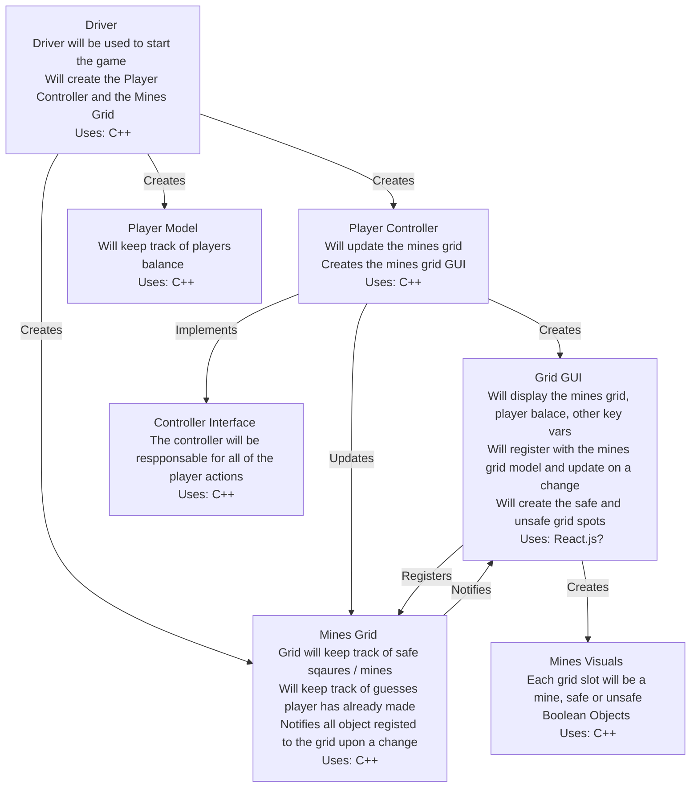
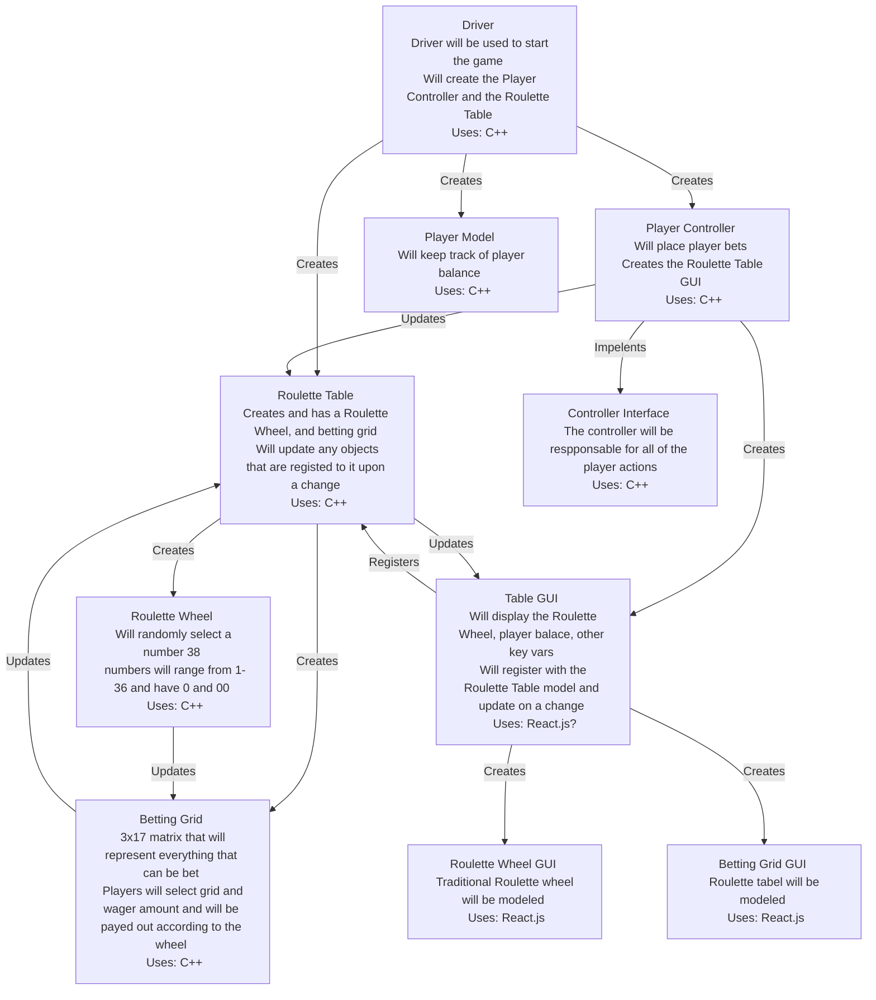
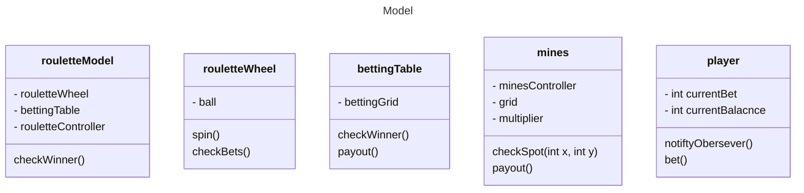
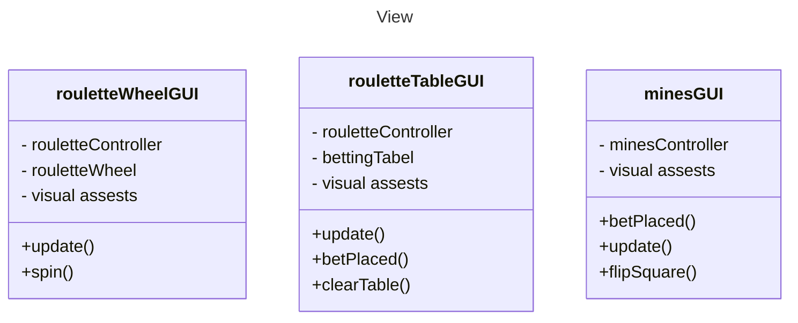
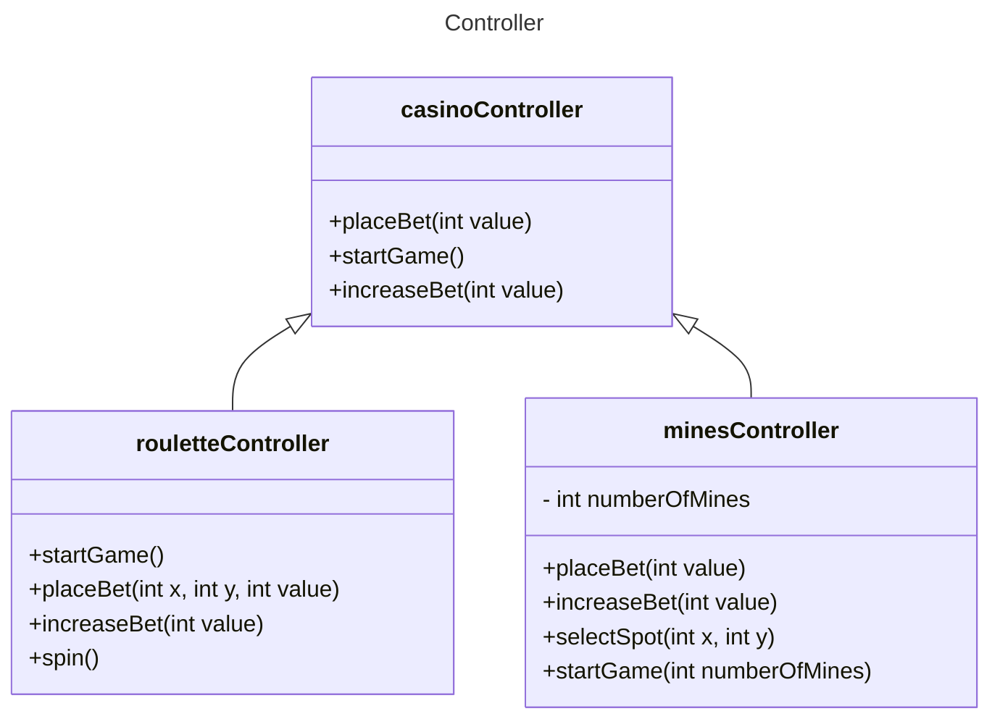

# High-Level Design Documentation

### Mine UML Diagram

```mermaid
graph TD;
    A[Driver <br/>Driver will be used to start the game <br>Will create the Player Controller and the Mines Grid<br>Uses: C++<br>];
    B[Player Controller <br/>Will update the mines grid<br>Creates the mines grid GUI  <br> Uses: C++];
    C[Mines Grid <br/>Grid will keep track of safe sqaures / mines<br>Will keep track of guesses player has already made<br>Notifies all object registed to the grid upon a change<br>Uses: C++];
    D[Grid GUI <br/>Will display the mines grid, player balace, other key vars<br>Will register with the mines grid model and update on a change<br>Will create the safe and unsafe grid spots<br> Uses: React.js?];
    E[Mines Visuals <br/>Each grid slot will be a mine, safe or unsafe<br>Boolean Objects <br>Uses: C++];
    F[Controller Interface <br/>The controller will be respponsable for all of the player actions<br>Uses: C++]
    G[Player Model <br/> Will keep track of players balance <br> Uses: C++]

    A --> |Creates| B;
    A --> |Creates| C;
    A --> |Creates| G;
    B --> |Creates| D;
    B --> |Updates| C;
    C --> |Notifies| D;
    D --> |Registers| C;
    D --> |Creates| E;
    B --> |Implements| F;
```

### Roulette UML Diagram

```mermaid
graph TD;
    A[Driver <br/> Driver will be used to start the game <br> Will create the Player Controller and the Roulette Table <br> Uses: C++ <br>];
    B[Player Controller <br/>Will place player bets <br> Creates the Roulette Table GUI <br> Uses: C++<br>];
    C[Roulette Table <br/>Creates and has a Roulette Wheel, and betting grid <br> Will update any objects that are registed to it upon a change <br> Uses: C++];
    D[Table GUI <br/> Will display the Roulette Wheel, player balace, other key vars <br> Will register with the Roulette Table model and update on a change <br> Uses: React.js?];
    F[Controller Interface <br/>The controller will be respponsable for all of the player actions<br>Uses: C++]
    G[Roulette Wheel <br/> Will randomly select a number 38 <br> numbers will range from 1-36 and have 0 and 00 <br> Uses: C++]
    H[Betting Grid <br/> 3x17 matrix that will represent everything that can be bet <br> Players will select grid and wager amount and will be payed out according to the wheel <br> Uses: C++]
    I[Roulette Wheel GUI <br/> Traditional Roulette wheel will be modeled <br> Uses: React.js]
    J[Betting Grid GUI <br/> Roulette tabel will be modeled <br> Uses: React.js]
    K[Player Model <br/> Will keep track of player balance <br> Uses: C++]

    A --> |Creates| B;
    A --> |Creates| C;
    A --> |Creates| K;
    B --> |Impelents| F;
    B --> |Updates| C;
    B --> |Creates| D;
    C --> |Creates| G;
    C --> |Creates| H;
    C --> |Updates| D;
    D --> |Creates| I;
    D --> |Creates| J;
    D --> |Registers| C;
    G --> |Updates| H;
    H --> |Updates| C;
```
### Model Class Diagram

```mermaid
---
title: Model
---
classDiagram
    class rouletteModel{
        - rouletteWheel
        - bettingTable
        - rouletteController

        checkWinner()

    }
    class rouletteWheel{
        - ball
        spin()
        checkBets()
    }

    class bettingTable{
        - bettingGrid
        checkWinner()
        payout()
    }

    class mines{
        - minesController
        - grid
        - multiplier
        checkSpot(int x, int y)
        payout()
    }

    class player{
        - int currentBet
        - int currentBalacnce

        notiftyObersever()
        bet()
    }
```
### View Class Diagram

```mermaid
---
title: View
---
classDiagram
    class rouletteWheelGUI{
        - rouletteController
        - rouletteWheel
        - visual assests
        +update()
        +spin()
    }

    class rouletteTableGUI{
        - rouletteController
        - bettingTabel
        - visual assests
        +update()
        +betPlaced()
        +clearTable()
    }

    class minesGUI{
        - minesController
        - visual assests
        +betPlaced()
        +update()
        +flipSquare()
    }
```

### Controller Class Diagram

```mermaid
---
title: Controller
---
classDiagram
    casinoController <|-- rouletteController
    casinoController <|-- minesController

    casinoController: +placeBet(int value)
    casinoController: +startGame()
    casinoController: +increaseBet(int value)


    class rouletteController{
        +startGame()
        +placeBet(int x, int y, int value)
        +increaseBet(int value)
        +spin()
    }

    class minesController{
        - int numberOfMines
        +placeBet(int value)
        +increaseBet(int value)
        +selectSpot(int x, int y)
        +startGame(int numberOfMines)

    }
```