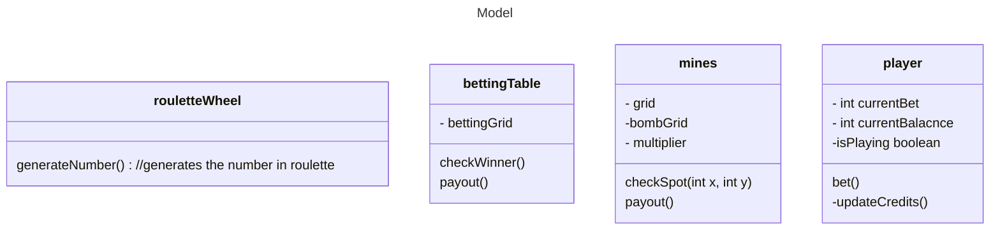

# High-Level Design Documentation

### Mine UML Diagram

```mermaid
graph TD;
graph TD;
graph TD;
    A[MainDriver.cpp <br/>Starts up the backend websocket where front end can send messages. MainDriver will parse these messages to deteremine what action needs to be taken.
    B[MinesModel.cpp <br/>Grid will keep track of safe squares / mines<br>Will keep track of guesses player has already made<br>Notifies all objects registered to the grid upon a change<br>Uses: C++];
    C[CoinGame.cpp <br/>Will update the mines grid<br>Creates the mines grid GUI<br>Uses: C++];
    D[BettingTable.js <br/>Will display the Roulette Table, player balance, other key vars<br>Will register with the Roulette Table model and update on a change<br>Uses: React.js?];
    E[RouletteWheel.js <br/>Traditional Roulette wheel will be modeled<br>Uses: React.js]
    
    A --> |Creates| B;
    A --> |Creates| C;
    A --> |Creates| D;
 

```

### Roulette UML Diagram

```mermaid
graph TD;
    A[Driver <br/> Driver will be used to start the game <br> Will create the Player Controller and the Roulette Table <br> Uses: C++ <br>];
    C[Roulette Table <br/>Creates and has a Roulette Wheel, and betting grid <br> Will update any objects that are registed to it upon a change <br> Uses: C++];
    G[Roulette Wheel <br/> Will randomly select a number 38 <br> numbers will range from 1-36 and have 0 and 00 <br> Uses: C++]
    H[Betting Grid <br/> 3x17 matrix that will represent everything that can be bet <br> Players will select grid and wager amount and will be payed out according to the wheel <br> Uses: C++]
    I[Roulette Wheel GUI <br/> Traditional Roulette wheel will be modeled <br> Uses: React.js]
    K[Player Model <br/> Will keep track of player balance,update credits, and other necessary functions. <br> Uses: C++]

   ?????? whats this stuff
```
### Model Class Diagram


### View Class Diagram

```mermaid
---
title: View
---
classDiagram
Each class contains a webSocket to communicate the the backend.

Roulette.js sends a betString to MainDriver.cpp which uses the roulette model
to parse and execute the correct payout.
    class Roulette.js{
        - visual assests
        +update()
        +spinButton()
        -betString
        socket.onmessage()
        socket.onopen()
        socket.onclose()
    }
    
    CoinFlip sends the head/tails plus the bet to backend to process.
    class CoinFlip.js{
        - visual assests
        -totalBet
        +bet()
        socket.onmessage()
        socket.onopen()
        socket.onclose()
    }

Mines.js communicates with MainDriver when user clicks a cell, clicks bet, or
clicks cashout. MinesModel.cpp keeps track of the grid and send this class
below a gridString so it can update the current grid.
    class Mines.Js{
        - visual assests
        -gridString
        +betPlaced()
        +update()
        +flipSquare()
        socket.onmessage()
        socket.onopen()
        socket.onclose()
    }
```

