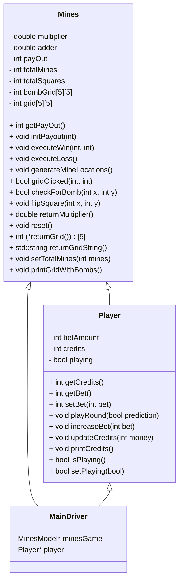
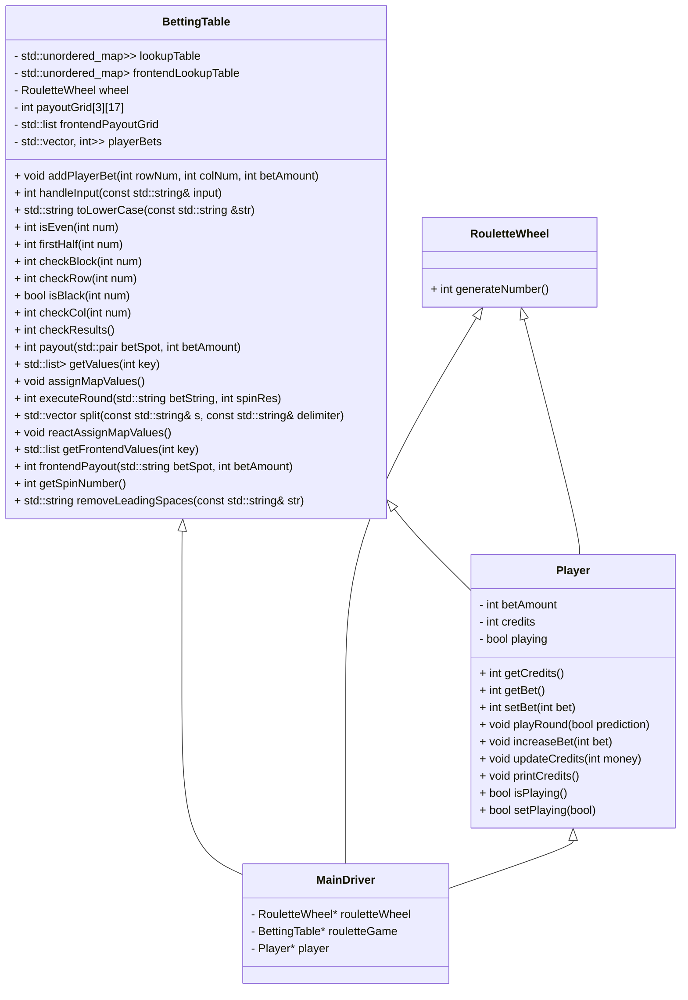
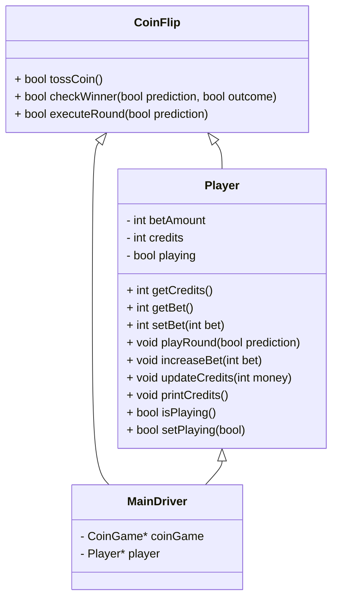

# High-Level Design Documentation

### Mines Class Diagram

    
 

### Roulette Class Diagram

### CoinFlip Class Diagram

## Description
MainDriver facilitates all communication from the frontend and backend. It's where the backend WebSocket lives so it knows what game is being played and tells the CPP models what to do.

We use CMake to run C++. To run the backend, use the following commands:
 
<code>mkdir build</code>
 
<code>cd build</code>
 
<code>cmake ..</code>
 
<code>make</code>
 
<code>./backend</code>

